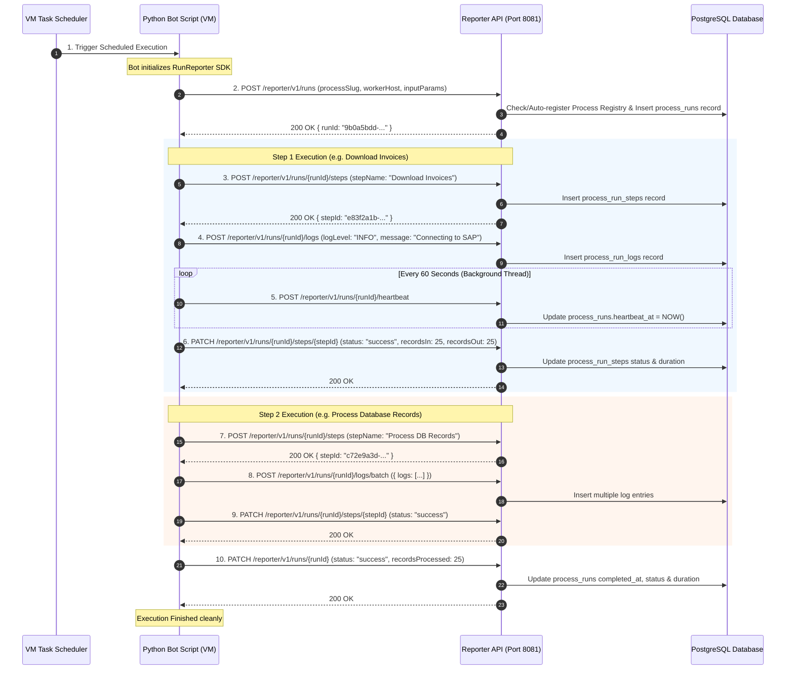

# RPA Orchestrator — Worker VM Process Flow & API Specifications

> **Version**: 1.0.0  
> **Environment**: Development / Local  
> **Reporter API Base URL**: `http://localhost:8081`  
> **Authentication Header**: `X-API-Key: dev_key_12345`  

---

## 1. Worker VM Process Flow & Sequence Workflow

This section illustrates how each worker VM interacts with the central Reporter API throughout an RPA bot's lifecycle.

### 1.1 High-Level Architecture
Each VM operates autonomously using local OS Task Scheduler or cron. All VMs report execution status centrally to port 8081 over HTTP using an API Key.

```
+-----------------------------------------------------------------------------------+
|                                  WORKER VM 1                                      |
|  [Windows Task Scheduler] ---> [Python Bot Script (InvoiceBot.py)]               |
|                                       |                                           |
+---------------------------------------|-------------------------------------------+
                                        | (HTTP Header X-API-Key: dev_key_12345)
                                        v
+-----------------------------------------------------------------------------------+
|                            RPA ORCHESTRATOR SERVER                                 |
|                                                                                   |
|   Reporter API (Port 8081)  =====>  PostgreSQL DB  =====>  Next.js Dashboard UI   |
|                                                                                   |
+-----------------------------------------------------------------------------------+
                                        ^
                                        | (HTTP Header X-API-Key: dev_key_12345)
+---------------------------------------|-------------------------------------------+
|  [Windows Task Scheduler] ---> [Python Bot Script (PayrollBot.py)]               |
|                                  WORKER VM 2                                      |
+-----------------------------------------------------------------------------------+
```

---

### 1.2 Sequence Diagram of VM Execution Lifecycle



---

### 1.3 Step-by-Step API Execution Workflow

1. **Bot Launch & Run Registration**:
   - The VM Task Scheduler launches the Python script.
   - The bot sends `POST /reporter/v1/runs` with `{ "processSlug": "invoice-processor", "workerHost": "VM-WORKER-01" }`.
   - The Reporter API checks if `invoice-processor` exists in the process catalog. If missing, it automatically creates a catalog entry.
   - Returns JSON containing `runId`.

2. **Step Start Notification**:
   - The bot enters a logical section of work (e.g. downloading reports).
   - The bot sends `POST /reporter/v1/runs/{runId}/steps` with `{ "stepName": "Download SAP Invoices", "stepOrder": 1 }`.
   - Returns JSON containing `stepId`.

3. **Structured Log Ingestion**:
   - As the bot executes, it streams logs via `POST /reporter/v1/runs/{runId}/logs` or in batches via `POST /reporter/v1/runs/{runId}/logs/batch`.
   - Logs are tagged with `runId`, `stepId`, `logLevel`, timestamp, and optional JSON context metadata.

4. **Heartbeat Maintenance**:
   - Every 60 seconds during long-running tasks, the bot issues `POST /reporter/v1/runs/{runId}/heartbeat`.
   - This informs the Orchestrator that the bot process is still alive and has not crashed or hung.

5. **Step Completion**:
   - When the step completes, the bot sends `PATCH /reporter/v1/runs/{runId}/steps/{stepId}` with `{ "status": "success", "recordsIn": 25, "recordsOut": 25 }`.

6. **Run Finalization & Error Handling**:
   - When all steps complete, the bot calls `PATCH /reporter/v1/runs/{runId}` with `{ "status": "success", "recordsProcessed": 25 }`.
   - If an unhandled Python exception occurs, the `try...except` block catches it and issues `PATCH /reporter/v1/runs/{runId}` with `{ "status": "failed", "errorMessage": "...", "errorTraceback": "..." }`.

---

## 2. Code-to-API Mapping Matrix

| Python SDK Statement | API Endpoint Triggered | HTTP Method & Body |
|---|---|---|
| `reporter.start_run()` | `/reporter/v1/runs` | `POST {"processSlug": "...", "workerHost": "..."}` |
| `with reporter.step("Step Name"):` | `/reporter/v1/runs/{runId}/steps` | `POST {"stepName": "Step Name", "stepOrder": 1}` |
| `reporter.log("message")` | `/reporter/v1/runs/{runId}/logs` | `POST {"logLevel": "INFO", "message": "..."}` |
| `reporter.log_batch([...])` | `/reporter/v1/runs/{runId}/logs/batch` | `POST {"logs": [...]}` |
| `reporter.heartbeat()` | `/reporter/v1/runs/{runId}/heartbeat` | `POST {}` |
| `context manager exit` | `/reporter/v1/runs/{runId}/steps/{stepId}` | `PATCH {"status": "success"}` |
| `reporter.complete()` | `/reporter/v1/runs/{runId}` | `PATCH {"status": "success", "recordsProcessed": N}` |

---

## 3. Full Reporter API Endpoint Reference

### 3.1 `GET /health` — Health Check
- **Headers**: None
- **Response `200 OK`**:
```json
{
  "status": "UP"
}
```

### 3.2 `POST /reporter/v1/runs` — Start Run
- **Headers**: `X-API-Key: dev_key_12345`, `Content-Type: application/json`
- **Request Body**:
```json
{
  "processSlug": "invoice-processor",
  "trigger": "scheduled",
  "workerHost": "VM-WORKER-01",
  "workerPid": 14208,
  "inputParams": {
    "batchId": "BATCH-2026-0811"
  }
}
```
- **Response `200 OK`**:
```json
{
  "id": "9b0a5bdd-cabc-4379-98fe-fe2993aaef34",
  "runId": "9b0a5bdd-cabc-4379-98fe-fe2993aaef34",
  "processId": "aa63794d-51d5-4f55-81ad-9fa3714d72f5",
  "processSlug": "invoice-processor",
  "status": "running",
  "startedAt": "2026-08-11T11:43:25.281Z",
  "heartbeatAt": "2026-08-11T11:43:25.281Z",
  "workerHost": "VM-WORKER-01",
  "attemptNumber": 1
}
```

### 3.3 `PATCH /reporter/v1/runs/{runId}` — Complete Run
- **Headers**: `X-API-Key: dev_key_12345`, `Content-Type: application/json`
- **Request Body (Success)**:
```json
{
  "status": "success",
  "recordsProcessed": 150,
  "recordsFailed": 2,
  "outputSummary": {
    "reportUrl": "https://storage.local/reports/batch-123.pdf"
  }
}
```
- **Request Body (Failure)**:
```json
{
  "status": "failed",
  "recordsProcessed": 45,
  "recordsFailed": 10,
  "errorMessage": "Element #submit-btn not clickable",
  "errorTraceback": "Traceback (most recent call last):\n  File \"script.py\", line 42...",
  "errorCategory": "ui_timeout"
}
```
- **Response `200 OK`**: Updated `ProcessRun` JSON object.

### 3.4 `POST /reporter/v1/runs/{runId}/heartbeat` — Heartbeat
- **Headers**: `X-API-Key: dev_key_12345`
- **Request Body**: `{}`
- **Response `200 OK`**: Empty response body.

### 3.5 `POST /reporter/v1/runs/{runId}/steps` — Start Step
- **Headers**: `X-API-Key: dev_key_12345`, `Content-Type: application/json`
- **Request Body**:
```json
{
  "stepName": "Download SAP Invoices",
  "stepOrder": 1
}
```
- **Response `200 OK`**:
```json
{
  "id": "e83f2a1b-4491-4c91-a1e2-048719283fbb",
  "stepId": "e83f2a1b-4491-4c91-a1e2-048719283fbb",
  "runId": "9b0a5bdd-cabc-4379-98fe-fe2993aaef34",
  "stepName": "Download SAP Invoices",
  "stepOrder": 1,
  "status": "running",
  "startedAt": "2026-08-11T11:44:00.000Z"
}
```

### 3.6 `PATCH /reporter/v1/runs/{runId}/steps/{stepId}` — Complete Step
- **Headers**: `X-API-Key: dev_key_12345`, `Content-Type: application/json`
- **Request Body**:
```json
{
  "status": "success",
  "recordsIn": 25,
  "recordsOut": 25,
  "details": {
    "downloadedFilesCount": 25
  }
}
```
- **Response `200 OK`**: Updated `ProcessRunStep` JSON object.

### 3.7 `POST /reporter/v1/runs/{runId}/logs` — Ingest Log Line
- **Headers**: `X-API-Key: dev_key_12345`, `Content-Type: application/json`
- **Request Body**:
```json
{
  "logLevel": "INFO",
  "message": "Successfully authenticated to SAP portal",
  "stepId": "e83f2a1b-4491-4c91-a1e2-048719283fbb"
}
```
- **Response `200 OK`**: Created `ProcessRunLog` JSON object.

### 3.8 `POST /reporter/v1/runs/{runId}/logs/batch` — Ingest Batch Logs
- **Headers**: `X-API-Key: dev_key_12345`, `Content-Type: application/json`
- **Request Body**:
```json
{
  "logs": [
    { "logLevel": "INFO", "message": "Processing record #1" },
    { "logLevel": "WARN", "message": "Record #2 missing code" }
  ]
}
```
- **Response `200 OK`**: Empty response body.
